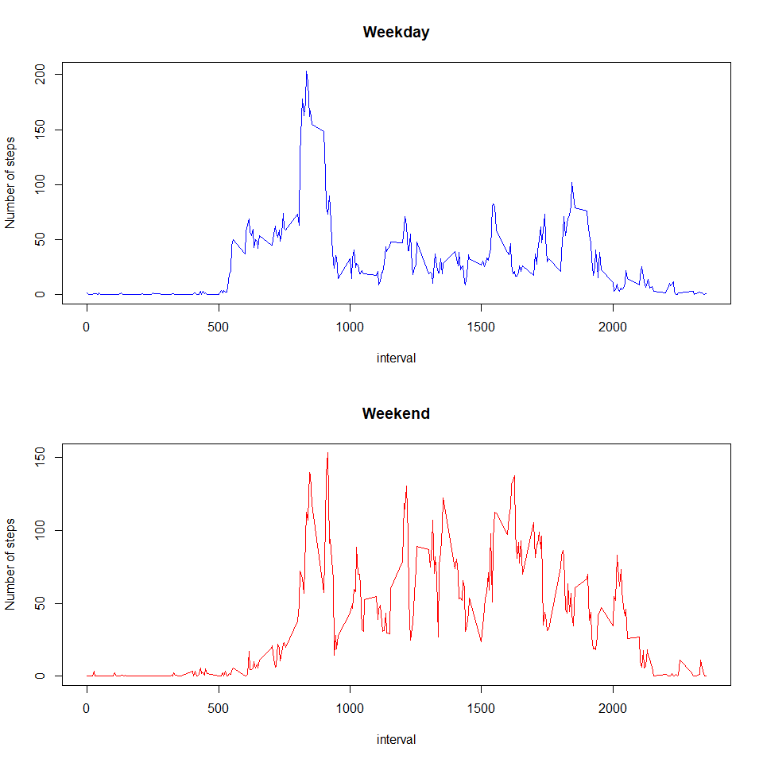

```r
knitr::opts_chunk$set(echo = TRUE, warning = FALSE, message = FALSE)
```

## Loading and preprocessing the data

```r
# Unzipped and read the file and
# converted the date column from character to Date type
activity <- read.csv(unzip("activity.zip"))
activity$date <- as.Date(activity$date)
```


## What is mean total number of steps taken per day?

```r
library(tidyverse)
total_steps_per_day <- activity %>%
  group_by(date) %>%
  summarize(total_steps = sum(steps, na.rm = TRUE))
head(total_steps_per_day,10)
```

```
## # A tibble: 10 × 2
##    date       total_steps
##    <date>           <int>
##  1 2012-10-01           0
##  2 2012-10-02         126
##  3 2012-10-03       11352
##  4 2012-10-04       12116
##  5 2012-10-05       13294
##  6 2012-10-06       15420
##  7 2012-10-07       11015
##  8 2012-10-08           0
##  9 2012-10-09       12811
## 10 2012-10-10        9900
```

```r
with(total_steps_per_day, hist(total_steps, main = "Total steps per day"))
```

<!-- -->

```r
# The mean number of steps taken per day
mean(total_steps_per_day$total_steps, na.rm = TRUE)
```

```
## [1] 9354.23
```

```r
# The median number of steps taken per day
median(total_steps_per_day$total_steps, na.rm = TRUE)
```

```
## [1] 10395
```

## What is the average daily activity pattern?

```r
daily_activity <- activity %>%
  group_by(interval) %>%
  summarize(average_steps = round(mean(steps, na.rm = TRUE), 2))
head(daily_activity, 10)
```

```
## # A tibble: 10 × 2
##    interval average_steps
##       <int>         <dbl>
##  1        0          1.72
##  2        5          0.34
##  3       10          0.13
##  4       15          0.15
##  5       20          0.08
##  6       25          2.09
##  7       30          0.53
##  8       35          0.87
##  9       40          0   
## 10       45          1.47
```

```r
plot(daily_activity, type = "l", col = "blue")
```

<!-- -->

```r
# the five minute interval containing the maximum number of steps
daily_activity$interval[which.max(daily_activity$average_steps)]
```

```
## [1] 835
```


## Imputing missing values

```r
# 1. Total number missing values in activity data set
sum(is.na(activity))
```

```
## [1] 2304
```

```r
# 2. Imputing missing values
## Imputing the missing values with the mean for those days.

## finding the dates, where the number of steps is NA
dates_withNA <- unique(activity$date[is.na(activity$steps)])
dates_withNA
```

```
## [1] "2012-10-01" "2012-10-08" "2012-11-01" "2012-11-04" "2012-11-09"
## [6] "2012-11-10" "2012-11-14" "2012-11-30"
```

```r
## finding the mean number of steps for the above dates
total_steps_per_day %>%
  filter(date %in% dates_withNA) %>%
  .$total_steps
```

```
## [1] 0 0 0 0 0 0 0 0
```

```r
## the total number of steps during all the above days is zero(0), hence the
## mean number of steps for the above days is 0.
## Imputing the NAs with 0 (zero).
activity_copy <- activity
activity_copy$steps[is.na(activity_copy$steps)] <- 0

# Calculating the total number of steps after imputing missing values
total_steps_after_impute <- activity_copy %>%
  group_by(date) %>%
  summarize(total_steps = sum(steps))
head(total_steps_after_impute, 10)
```

```
## # A tibble: 10 × 2
##    date       total_steps
##    <date>           <dbl>
##  1 2012-10-01           0
##  2 2012-10-02         126
##  3 2012-10-03       11352
##  4 2012-10-04       12116
##  5 2012-10-05       13294
##  6 2012-10-06       15420
##  7 2012-10-07       11015
##  8 2012-10-08           0
##  9 2012-10-09       12811
## 10 2012-10-10        9900
```

```r
with(total_steps_after_impute, hist(total_steps,
                                    main = "Total number of steps per day"))
```

<!-- -->

```r
# mean number of steps after imputing NAs
mean(total_steps_after_impute$total_steps)
```

```
## [1] 9354.23
```

```r
# median number of steps after imputing NAs
median(total_steps_after_impute$total_steps)
```

```
## [1] 10395
```

The values do not differ from the first part of assessment.

```r
# comparison of total number of steps per day
differ <- cbind(total_steps_per_day$total_steps,
          total_steps_after_impute$total_steps)
identical(differ[,1], differ[,2])
```

```
## [1] TRUE
```

```r
# comparison of mean
mean(differ[,1]) == mean(differ[,2])
```

```
## [1] TRUE
```

```r
# comparison of median values
median(differ[,1]) == median(differ[,2])
```

```
## [1] TRUE
```
There has been no impact on any of the values after imputing NAs with mean
number of steps taken per day. The dates with NAs were identified and the
number of steps during those dates is zero. The mean number of number of steps
is also zero. Hence in this case imputing with mean number of steps i.e. zero
had no impact.  

## Are there differences in activity patterns between weekdays and weekends?

First created a variable day_name using the weekdays() function to generate
day name. Then created another variable dayEnd_factor, using ifelse() function
which checks the values of day_name column, if the names are any of the five 
weekdays, then the dayEnd_factor takes the value "Weekday", else it takes the
value "Weekend".  


```r
activity_copy <- activity_copy %>%
  mutate(dayEnd_factor = ifelse(weekdays(date) %in% c("Saturday", "Sunday"),
                                "Weekend", "Weekday"))

# Calculating the average number of steps for weekdays
weekday_pattern <- activity_copy %>%
  filter(dayEnd_factor == "Weekday") %>%
  group_by(interval) %>%
  summarize(average_steps = mean(steps))

# Calculating the average number of steps for weekends
weekend_pattern <- activity_copy %>%
  filter(dayEnd_factor == "Weekend") %>%
  group_by(interval) %>%
  summarize(average_steps = mean(steps))

par(mfrow = c(2, 1))
plot(weekday_pattern, type = "l", col = "blue", main = "Weekday",
     ylab = "Number of steps")
plot(weekend_pattern, type = "l", col = "red", main = "Weekend",
     ylab = "Number of steps")
```

<!-- -->

One obvious difference in the patterns between week days and weekends is, on
weekdays once in a while the subject climbed 200 steps, the rest of the time the
activity would be below 100 steps around 50 step, but on weekends the
subject frequently climbed 100 steps, suggesting work around during weekends.
